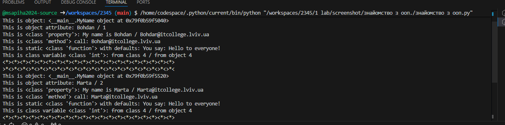
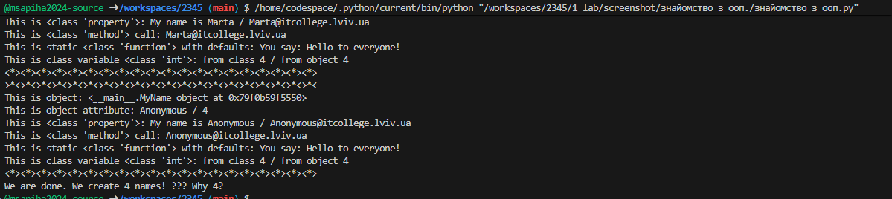

# Звіт до роботи
## Тема: Знайомство з ООП згідно теми_
### Мета роботи: Навчитись використовувати основні принципи ООП, розглянути кострукції побудови класу та створення обєктів та навчитись працювати з ними згідно теми_

---
### Виконання роботи
* Результати виконання завдання *1...N*;
    1. Розробили/Створили перший клас
    1. Програма вивела значення 
    1. Отримано наступні результати 
    1. Навчились бути програмістом
* вставлені рисунки (скріншоти екрана або фотографії виконаного завдання у зошиті);
    > якщо графічних файлів багато то краще помістити їх у  окрему папку, наприклад у мене це папка `pictures`. Уважно   дивіться коли вставляєте URL - файл має бути представленим    як `raw`. А краще користуйтесь локальними шляхами!

* з використанням URL 
    
* через локальні шляхи 

* вставлений код / текстовий або числовий результат / інші результати:
    - так можна вставляти код, або просто вствляйте посилання на файл з програмою;
    ```python
    def simple_function_example():
        pass
    ```
    - якщо потрібно виділити текст, тоді:
    ```text
    << Тут можна писати те що хочемо виокремити >>
    ```

Відповіді на індивідуальні завдання:
1) Тому що у методі __init__ реалізована умовна логіка:
self.name = name if name is not None else self.anonymous_user().name
Якщо name дорівнює None → викликається метод anonymous_user(), який створює об'єкт з іменем "Anonymous" як значення за замовчуванням.
2)Потрібно змінити текст у тілі методу say_hello()
приклад: def say_hello():
    print("Привіт, світ!")

3)class Person:
    def count_letters(self, name):
        return len(name)

4)Кількість різна, бо деякі елементи списку порожні, містять пробіли або повторюються, а виведення може їх фільтрувати або ігнорувати.
5)class Person:
    def __init__(self, name):
        self.name = name.capitalize()

6)def create_email(self, domain):
    return f"{self.name.lower()}@{domain}"

7)class Person:
    def __init__(self, name):
        if not name.isalpha():
            raise ValueError("Ім'я може містити лише літери!")
        self.name = name.capitalize()

8)@property
def full_name(self):
    return f"User #{self.id}: {self.name} ({self.email})"

9)def save_to_file(self, filename="users.txt"):
    with open(filename, "a", encoding="utf-8") as f:
        f.write(self.full_name + "\n")


---
### Висновок:
> у висновку потрібно відповісти на запитання:

- :question: Що зроблено в роботі;
- :question: Чи досягнуто мети роботи;
- :question: Які нові знання отримано;
- :question: Чи вдалось відповісти на всі питання задані в ході роботи;
- :question: Чи вдалося виконати всі завдання;
- :question: Чи виникли складності у виконанні завдання;
- :question: Чи подобається такий формат здачі роботи (Feedback);
- :question: Побажання для покращення (Suggestions);

---
